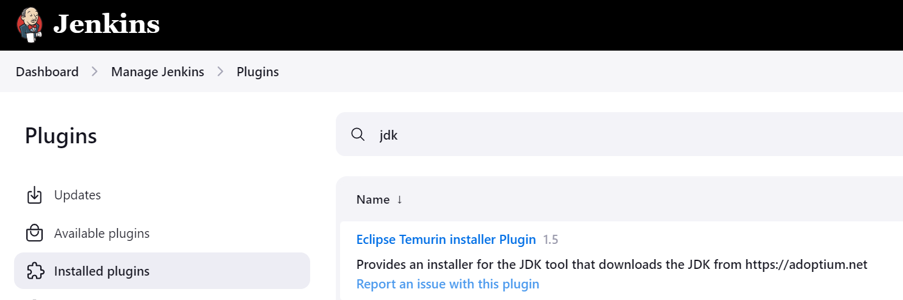

On the jenkins server

docker build -t ooo:latest

docker run -d -p 3077:3077 --name container sss

-------------------
#!/bin/bash

#Update packages
sudo yum update -y

#Install Java 17 Amazon Corretto
sudo dnf install java-17-amazon-corretto-devel -y

#Install EPEL repository
sudo amazon-linux-extras install epel -y

#Install Jenkins
sudo wget -O /etc/yum.repos.d/jenkins.repo https://pkg.jenkins.io/redhat-stable/jenkins.repo
sudo rpm --import https://pkg.jenkins.io/redhat-stable/jenkins.io-2023.key
sudo yum install jenkins -y

#Start and enable Jenkins
sudo systemctl start jenkins
sudo systemctl enable jenkins

#Install Git
sudo yum install git -y

#Install Docker
sudo yum install docker -y
sudo systemctl start docker
sudo systemctl enable docker

#Create a group called 'docker' if it does not already exist
if ! getent group docker >/dev/null; then
    sudo groupadd docker
fi

#Create a user called 'jenkins' if it does not already exist
if ! id "jenkins" &>/dev/null; then
    sudo useradd -m jenkins
fi

#Add the user 'jenkins' to the 'docker' group
sudo usermod -aG docker jenkins

#Restart the Docker service
sudo systemctl restart docker

#Restart Jenkins
sudo systemctl restart jenkins

#Run SonarQube Docker container
sudo docker run -d --name sonar -p 9000:9000 sonarqube:lts-community

#Output a message for confirmation
echo "Java 17 installed, Docker group created, user 'jenkins' added to it, Jenkins has been restarted, and SonarQube container is running."

-------------------

#Output a message for confirmation
echo "Java 17 installed, Docker group created, user 'jenkins' added to it, and Jenkins has been restarted."

-------------------
Install Docker Compose
yum install -y curl
curl -SL https://github.com/docker/compose/releases/download/v2.25.0/docker-compose-linux-x86_64 -o /usr/local/bin/docker-compose
chmod +x /usr/local/bin/docker-compose
ln -s /usr/local/bin/docker-compose /usr/bin/docker-compose

Install Maven
wget https://dlcdn.apache.org/maven/maven-3/3.9.9/binaries/apache-maven-3.9.9-bin.tar.gz
tar -xvf apache-maven-3.9.9-bin.tar.gz -C /opt
ln -s /opt/apache-maven-3.9.9 /opt/maven

Set up Maven environment variables
cat <<EOL > /etc/profile.d/maven.sh
M2_HOME='/opt/apache-maven-3.9.9'
PATH="\$M2_HOME/bin:\$PATH"
export PATH
EOL

chmod +x /etc/profile.d/maven.sh
source /etc/profile.d/maven.sh
------------------------------------------------------

# SonarQube

docker run -d --name sonar -p 9000:9000 sonarqube:lts-community

