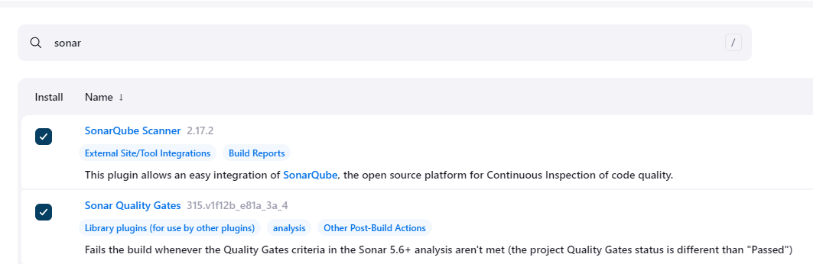
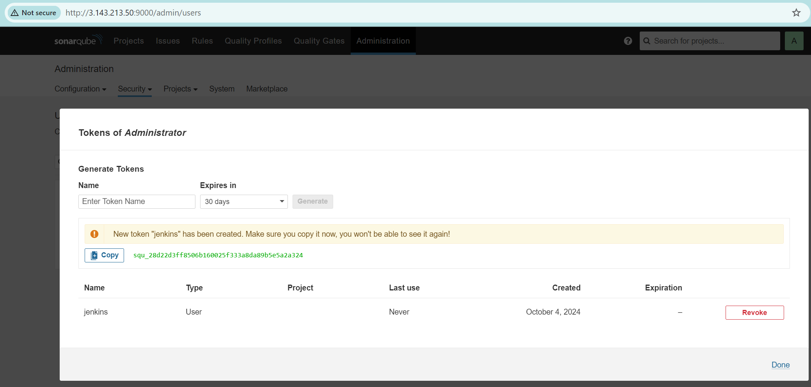
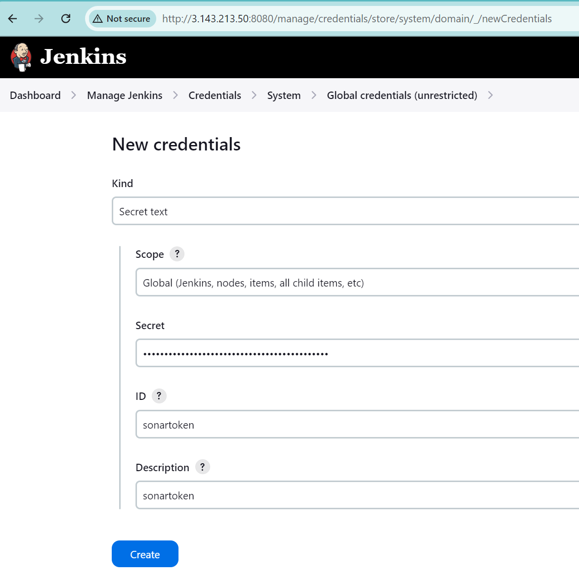
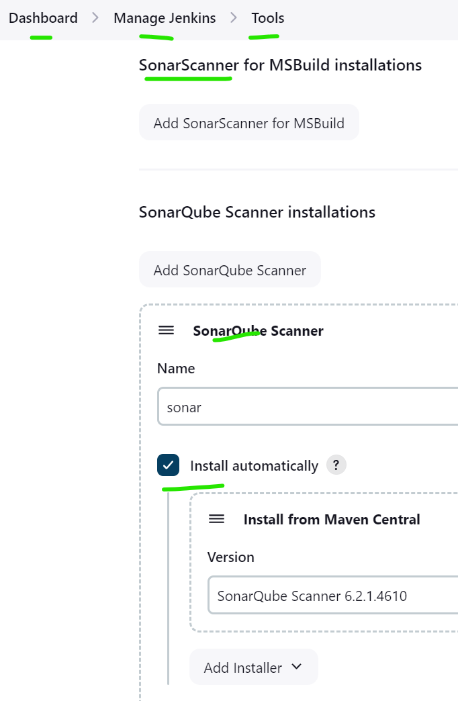
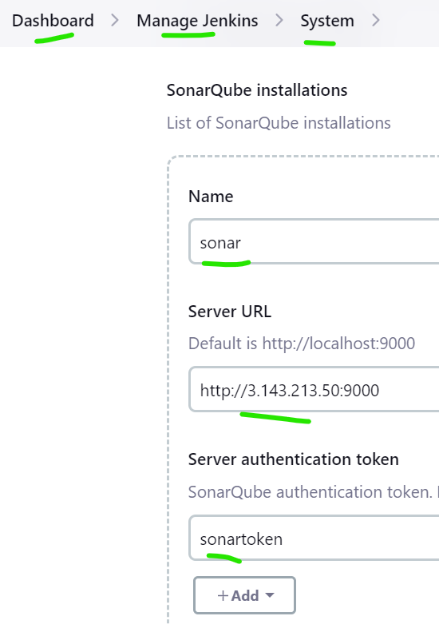

On the jenkins server

docker build -t ooo:latest

docker run -d -p 3077:3077 --name container sss

sudo usermod -aG docker jenkins

sudo systemctl restart jenkins

----------------------------------------------------------------

#!/bin/bash

Update packages
yum update -y

Install Java 17
sudo yum install java17

Install EPEL repository
amazon-linux-extras install epel -y

Install Jenkins
sudo wget -O /etc/yum.repos.d/jenkins.repo https://pkg.jenkins.io/redhat-stable/jenkins.repo
sudo rpm --import https://pkg.jenkins.io/redhat-stable/jenkins.io-2023.key
yum install jenkins -y

Start and enable Jenkins
systemctl start jenkins
systemctl enable jenkins

Install Git
yum install git -y

Install Docker
yum install docker -y
systemctl start docker
systemctl enable docker

Add Jenkins user to Docker group
usermod -aG docker jenkins

Install Docker Compose
yum install -y curl
curl -SL https://github.com/docker/compose/releases/download/v2.25.0/docker-compose-linux-x86_64 -o /usr/local/bin/docker-compose
chmod +x /usr/local/bin/docker-compose
ln -s /usr/local/bin/docker-compose /usr/bin/docker-compose

Install Maven
wget https://dlcdn.apache.org/maven/maven-3/3.9.9/binaries/apache-maven-3.9.9-bin.tar.gz
tar -xvf apache-maven-3.9.9-bin.tar.gz -C /opt
ln -s /opt/apache-maven-3.9.9 /opt/maven

Set up Maven environment variables
cat <<EOL > /etc/profile.d/maven.sh
M2_HOME='/opt/apache-maven-3.9.9'
PATH="\$M2_HOME/bin:\$PATH"
export PATH
EOL

chmod +x /etc/profile.d/maven.sh
source /etc/profile.d/maven.sh
------------------------------------------------------

# SonarQube

docker run -d --name sonar -p 9000:9000 sonarqube:lts-community

